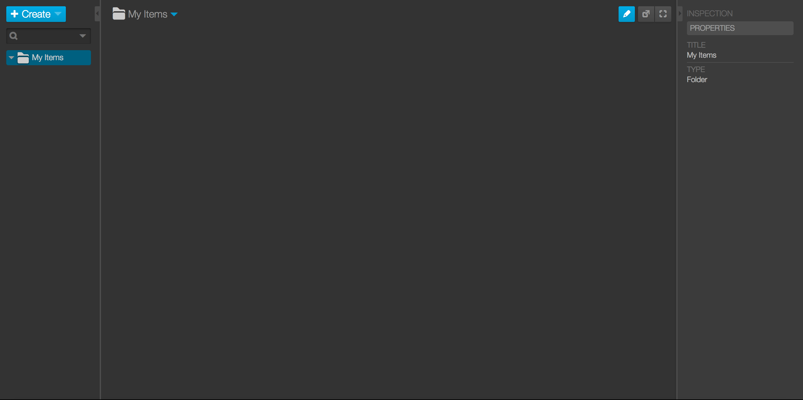
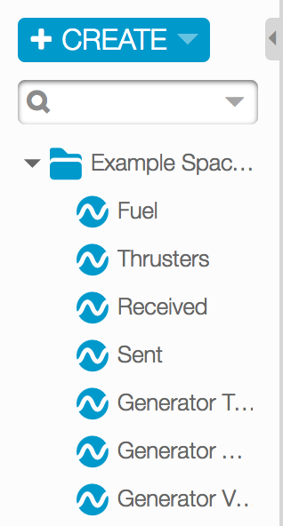
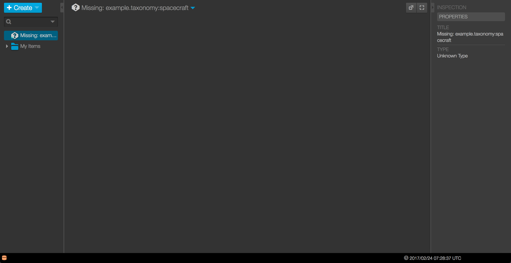
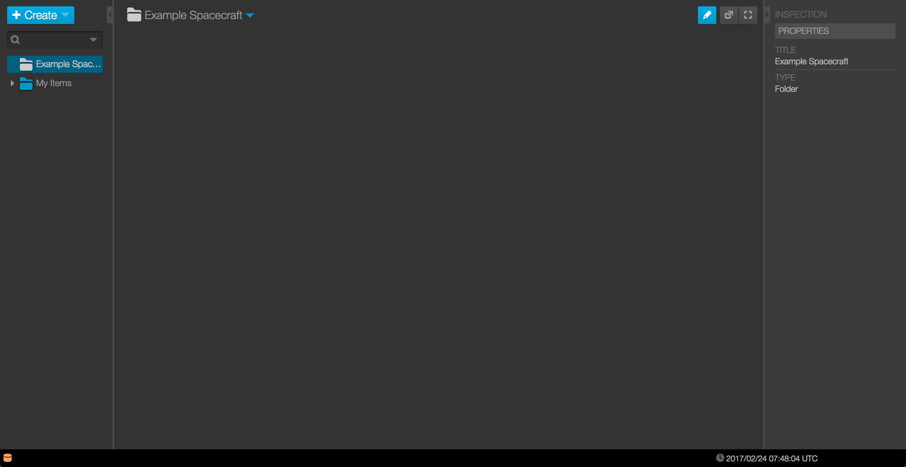
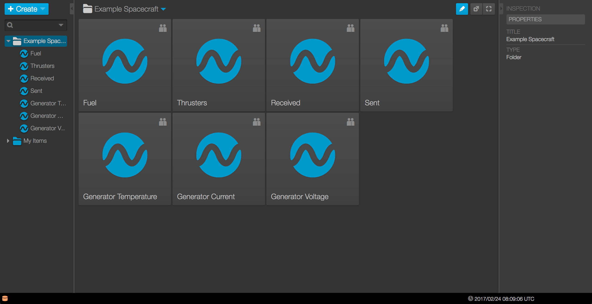

# Open MCT Integration Tutorials

These tutorials will walk you through the simple process of integrating your telemetry systems with Open MCT.  In case you don't have any telemetry systems, we've included a reference implementation of a historical and realtime server.  We'll take you through the process of integrating those services with Open MCT.

## Tutorial Prerequisites

* [node.js](https://nodejs.org/en/)
    * Mac OS: We recommend using [Homebrew](https://brew.sh/) to install node.
    ```
    $ brew install node
    ```
    * Windows: https://nodejs.org/en/download/
    * linux: https://nodejs.org/en/download/
* [git](https://git-scm.com/)
    * Mac OS: If XCode is installed, git is likely to already be available from your command line. If not, git can be installed using [Homebrew](https://brew.sh/).
    ```
    $ brew install git
    ```
    * Windows: https://git-scm.com/downloads
    * linux: https://git-scm.com/downloads

Neither git nor node.js are requirements for using Open MCT, however this tutorial assumes that both are installed. Also, command line familiarity is a plus, however the tutorial is written in such a way that it should be possible to copy-paste the steps verbatim into a POSIX command line.

## Installing the tutorials

```
git clone https://github.com/nasa/openmct-tutorial.git
cd openmct-tutorial
npm install
npm start
```

This will clone the tutorials and install Open MCT from NPM.  It will also install the dependencies needed to run the provided telemetry server. The last command will start the server. The telemetry server provided is for demonstration purposes only, and is not intended to be used in a production environment.

At this point, you will be able to browse the tutorials in their completed state.  We have also tagged the repository at each step of the tutorial, so it is possible to skip to a particular step using git checkout.

eg.

```
git checkout -f part-X-step-N
```

Substituting the appropriate part and step numbers as necessary.

The recommended way of following the tutorials is to checkout the first step (the command is shown below), and then follow the tutorial by manually adding the code, but if you do get stuck you can use the tags to skip ahead. If you do get stuck, please let us know by [filing in issue in this repository](https://github.com/nasa/openmct-tutorial/issues/new) so that we can improve the tutorials.

All source files that you create while following this tutorial should be created in the `openmct-tutorial` directory, unless otherwise specified.

## Part A: Running Open MCT
**Shortcut**: `git checkout -f part-a`

We're going to define a single `index.html` page.  We'll include the Open MCT library, configure a number of plugins, and then start the application.

[index.html](https://github.com/nasa/openmct-tutorial/tree/part-b-step-1/index.html)
```html
<!DOCTYPE html>
<html>
<head>
    <title>Open MCT Tutorials</title>
    <script src="node_modules/openmct/dist/openmct.js"></script>
    <script src="lib/http.js"></script>
</head>
<body>
    <script>
        openmct.setAssetPath('node_modules/openmct/dist');
        openmct.install(openmct.plugins.LocalStorage());
        openmct.install(openmct.plugins.MyItems());
        openmct.install(openmct.plugins.UTCTimeSystem());
        openmct.time.clock('local', {start: -15 * 60 * 1000, end: 0});
        openmct.time.timeSystem('utc');
        openmct.install(openmct.plugins.Espresso());

        openmct.start();
    </script>
</body>
</html>
```

We have provided a basic server for the purpose of this tutorial, which will act as a web server as well as a telemetry source. This server is for demonstration purposes only. The Open MCT web client can be hosted on any http server. 

If the server is not already running, run it now -

```
npm start
```

If you open a web browser and navigate to http://localhost:8080/ you will see the Open MCT application running. Currently it is populated with one object named `My Items`. 



In this tutorial we will populate this tree with a number of objects representing telemetry points on a fictional spacecraft, and integrate with a telemetry server in order to receive and display telemetry for the spacecraft.

# Part B - Populating the Object Tree
## Introduction
In Open MCT everything is represented as a Domain Object, this includes sources of telemetry, telemetry points, and views for visualizing telemetry. Domain Objects are accessible from the object tree 



The object tree is a hierarchical representation of all of the objects available in Open MCT. At the root of an object hierarchy is a root object. For this tutorial, we are going to create a new root object representing our spacecraft, and then populate it with objects representing the telemetry producing subsystems on our fictional spacecraft.

## Step 1 - Defining a new plugin
**Shortcut:** `git checkout -f part-b-step-1`

Let's start by creating a new plugin to populate the object tree. We will include all of the code for this plugin in a new javascript file named `dictionary-plugin.js`. Let's first create a very basic plugin that simply logs a message indicating that it's been installed.

[dictionary-plugin.js](https://github.com/nasa/openmct-tutorial/blob/part-b-step-2/dictionary-plugin.js)
```javascript
function DictionaryPlugin() {
    return function install() {
        console.log("I've been installed!");
    }
};
```
Note that when the `install` function is invoked, the [Open MCT API will be provided as the first parameter](https://github.com/nasa/openmct/blob/master/API.md#defining-and-installing-a-new-plugin). In this simple case we don't use it, so it has been left out.

Next, we'll update index.html to include the file:

[index.html](https://github.com/nasa/openmct-tutorial/blob/part-b-step-2/index.html)
```html
<!DOCTYPE html>
<html>
<head>
    <title>Open MCT Tutorials</title>
    <script src="node_modules/openmct/dist/openmct.js"></script>
    <script src="lib/http.js"></script>
    <script src="dictionary-plugin.js"></script>
</head>
<body>
    <script>
        openmct.setAssetPath('node_modules/openmct/dist');
        openmct.install(openmct.plugins.LocalStorage());
        openmct.install(openmct.plugins.MyItems());
        openmct.install(openmct.plugins.UTCTimeSystem());
        openmct.time.clock('local', {start: -15 * 60 * 1000, end: 0});
        openmct.time.timeSystem('utc');
        openmct.install(openmct.plugins.Espresso());

        openmct.install(DictionaryPlugin());

        openmct.start();
    </script>
</body>
</html>
```

If we reload the browser now, and open a javascript console, we should see the following message 

```
I've been installed.
```

The process of opening a javascript console differs depending on the browser being used. Instructions for launching the browser console in most modern browsers are [available here](http://webmasters.stackexchange.com/a/77337).

In summary, an Open MCT plugin is very simple: it's an initialization function which receives the Open MCT API as the single argument.  It then uses the provided API to extend Open MCT.  Generally, we like plugins to return an initialization function so they can receive configuration.

[Learn more about plugins here](https://github.com/nasa/openmct/blob/master/API.md#plugins)

## Step 2 - Creating a new root node
**Shortcut:** `git checkout -f part-b-step-2`

To be able to access our spacecraft objects from the tree, we first need to define a root. We will use the Open MCT API to define a new root object representing our spacecraft. 

[dictionary-plugin.js](https://github.com/nasa/openmct-tutorial/blob/part-b-step-3/dictionary-plugin.js)
```javascript
function DictionaryPlugin() {
    return function install(openmct) {
        openmct.objects.addRoot({
            namespace: 'example.taxonomy',
            key: 'spacecraft'
        });
    }
};
```

A new root is added to the object tree using the `addRoot` function exposed by the Open MCT API. `addRoot` accepts an object identifier - defined as a javascript object with a `namespace` and a `key` attribute. [More information on objects and identifiers](https://github.com/nasa/openmct/blob/master/API.md#domain-objects-and-identifiers) is available in our API.

If we reload the browser now, we should see a new object in the tree.
 
 
 
Currently it will appear as a question mark with `Missing: example.taxonomy:spacecraft` next to it. This is because for now all we've done is provide an identifier for the root node. In the next step, we will define an __Object Provider__, which will provide Open MCT with an object for this identifier. A [basic overview of object providers](https://github.com/nasa/openmct/blob/master/API.md#object-providers) is available in our API documentation.

## Step 3 - Providing objects
**Shortcut:** `git checkout -f part-b-step-3`

Now we will start populating the tree with objects. To do so, we will define an object provider. An Object Provider receives an object identifier, and returns a promise that resolve with an object for the given identifier (if available).  In this step we will produce some objects to represent the parts of the spacecraft that produce telemetry data, such as subsystems and instruments. Let's call these telemetry producing things __telemetry points__. Below some code defining and registering an object provider for the new "spacecraft" root object:

[dictionary-plugin.js](https://github.com/nasa/openmct-tutorial/blob/part-b-step-4/dictionary-plugin.js)
```javascript
function getDictionary() {
    return http.get('/dictionary.json')
        .then(function (result) {
            return result.data;
        });
}

var objectProvider = {
    get: function (identifier) {
        return getDictionary().then(function (dictionary) {
            if (identifier.key === 'spacecraft') {
                return {
                    identifier: identifier,
                    name: dictionary.name,
                    type: 'folder',
                    location: 'ROOT'
                };
            }
        });
    }
};

function DictionaryPlugin() {
    return function install(openmct) {
        openmct.objects.addRoot({
            namespace: 'example.taxonomy',
            key: 'spacecraft'
        });
        
        openmct.objects.addProvider('example.taxonomy', objectProvider);
    }
};
```

If we reload our browser now, the unknown object in our tree should be replaced with an object named "Example Spacecraft" with a folder icon. 



The root object uses the builtin type `folder`. For the objects representing the telemetry points for our spacecraft, we will now register a new object type.

Snippet from [dictionary-plugin.js](https://github.com/nasa/openmct-tutorial/blob/part-c/dictionary-plugin.js#L65-L69)
```javascript
openmct.types.addType('example.telemetry', {
    name: 'Example Telemetry Point',
    description: 'Example telemetry point from our happy tutorial.',
    cssClass: 'icon-telemetry'
});
```

Here we define a new type with a key of `example.telemetry`. For details on the attributes used to specify a new Type, please [see our documentation on object Types](https://github.com/nasa/openmct/blob/master/API.md#domain-object-types)
 
Finally, let's modify our object provider to return objects of our newly registered type. Our dictionary plugin will now look like this:

[dictionary-plugin.js](https://github.com/nasa/openmct-tutorial/blob/part-b-step-4/dictionary-plugin.js)
```javascript
function getDictionary() {
    return http.get('/dictionary.json')
        .then(function (result) {
            return result.data;
        });
}

var objectProvider = {
    get: function (identifier) {
        return getDictionary().then(function (dictionary) {
            if (identifier.key === 'spacecraft') {
                return {
                    identifier: identifier,
                    name: dictionary.name,
                    type: 'folder',
                    location: 'ROOT'
                };
            } else {
                var measurement = dictionary.measurements.filter(function (m) {
                    return m.key === identifier.key;
                })[0];
                return {
                    identifier: identifier,
                    name: measurement.name,
                    type: 'example.telemetry',
                    telemetry: {
                        values: measurement.values
                    },
                    location: 'example.taxonomy:spacecraft'
                };
            }
        });
    }
};

function DictionaryPlugin() {
    return function install(openmct) {
        openmct.objects.addRoot({
            namespace: 'example.taxonomy',
            key: 'spacecraft'
        });
        
        openmct.objects.addProvider('example.taxonomy', objectProvider);
    }
};
```

Although we have now defined an Object Provider for both the "Example Spacecraft" and its children (the telemetry measurements), if we refresh our browser at this point we won't see any more objects in the tree. This is because we haven't defined the structure of the tree yet.

## Step 4 - Populating the tree
**Shortcut:** `git checkout -f part-b-step-4`

We have defined a root node in [Step 2](https://github.com/nasa/openmct-tutorial/blob/part-b-step-3/dictionary-plugin.js) and we have provided some objects that will appear in the tree. Now we will provide structure to the tree and define the relationships between objects in the tree. This is achieved with a __[Composition Provider](https://github.com/nasa/openmct/blob/master/API.md#composition-providers)__.

Snippet from [dictionary-plugin.js](https://github.com/nasa/openmct-tutorial/blob/part-c/dictionary-plugin.js#L36-L52)
```javascript
var compositionProvider = {
    appliesTo: function (domainObject) {
        return domainObject.identifier.namespace === 'example.taxonomy' &&
               domainObject.type === 'folder';
    },
    load: function (domainObject) {
        return getDictionary()
            .then(function (dictionary) {
                return dictionary.measurements.map(function (m) {
                    return {
                        namespace: 'example.taxonomy',
                        key: m.key
                    };
                });
            });
    }
};

openmct.composition.addProvider(compositionProvider);
```
A Composition Provider accepts a Domain Object, and provides identifiers for the children of that object. For the purposes of this tutorial we will return identifiers for the telemetry points available from our spacecraft. We build these from our spacecraft telemetry dictionary file.

Our plugin should now look like this:

[dictionary-plugin.js](https://github.com/nasa/openmct-tutorial/blob/part-c/dictionary-plugin.js)
```javascript
function getDictionary() {
    return http.get('/dictionary.json')
        .then(function (result) {
            return result.data;
        });
}

var objectProvider = {
    get: function (identifier) {
        return getDictionary().then(function (dictionary) {
            if (identifier.key === 'spacecraft') {
                return {
                    identifier: identifier,
                    name: dictionary.name,
                    type: 'folder',
                    location: 'ROOT'
                };
            } else {
                var measurement = dictionary.measurements.filter(function (m) {
                    return m.key === identifier.key;
                })[0];
                return {
                    identifier: identifier,
                    name: measurement.name,
                    type: 'example.telemetry',
                    telemetry: {
                        values: measurement.values
                    },
                    location: 'example.taxonomy:spacecraft'
                };
            }
        });
    }
};

var compositionProvider = {
    appliesTo: function (domainObject) {
        return domainObject.identifier.namespace === 'example.taxonomy' &&
               domainObject.type === 'folder';
    },
    load: function (domainObject) {
        return getDictionary()
            .then(function (dictionary) {
                return dictionary.measurements.map(function (m) {
                    return {
                        namespace: 'example.taxonomy',
                        key: m.key
                    };
                });
            });
    }
};

function DictionaryPlugin() {
    return function install(openmct) {
        openmct.objects.addRoot({
            namespace: 'example.taxonomy',
            key: 'spacecraft'
        });
    
        openmct.objects.addProvider('example.taxonomy', objectProvider);
    
        openmct.composition.addProvider(compositionProvider);
    
        openmct.types.addType('example.telemetry', {
            name: 'Example Telemetry Point',
            description: 'Example telemetry point from our happy tutorial.',
            cssClass: 'icon-telemetry'
        });
    };
};
```

At this point, if we reload the page we should see a fully populated object tree. 



Clicking on our telemetry points will display views of those objects, but for now we don't have any telemetry for them. The tutorial telemetry server will provide telemetry for these points, and in the following steps we will define some telemetry adapters to retrieve telemetry data from the server, and provide it to Open MCT. 

# Part C - Integrate/Provide/Request Telemetry
**Shortcut:** `git checkout -f part-c`

Open MCT supports receiving telemetry by requesting data from a telemetry store, and by subscribing to real-time telemetry updates. In this part of the tutorial we will define and register a telemetry adapter for requesting historical telemetry from our tutorial telemetry server. Let's define our plugin in a new file named `historical-telemetry-plugin.js`

[historical-telemetry-plugin.js](https://github.com/nasa/openmct-tutorial/blob/part-d/historical-telemetry-plugin.js)
```javascript
/**
 * Basic historical telemetry plugin.
 */

function HistoricalTelemetryPlugin() {
    return function install (openmct) {
        var provider = {
            supportsRequest: function (domainObject) {
                return domainObject.type === 'example.telemetry';
            },
            request: function (domainObject, options) {
                var url = '/history/' +
                    domainObject.identifier.key +
                    '?start=' + options.start +
                    '&end=' + options.end;
    
                return http.get(url)
                    .then(function (resp) {
                        return resp.data;
                    });
            }
        };
    
        openmct.telemetry.addProvider(provider);
    }
}
```

The telemetry adapter above defines two functions. The first of these, `supportsRequest`, is necessary to indicate that this telemetry adapter supports requesting telemetry from a telemetry store. The `request` function will retrieve telemetry data and return it to the Open MCT application for display.

Our request function also accepts some options. Here we support the specification of a start and end date.

With our adapter defined, we need to update `index.html` to include it.

[index.html](https://github.com/nasa/openmct-tutorial/blob/part-d/index.html)
```html
<!DOCTYPE html>
<html>
<head>
    <title>Open MCT Tutorials</title>
    <script src="node_modules/openmct/dist/openmct.js"></script>
    <script src="lib/http.js"></script>
    <script src="dictionary-plugin.js"></script>
    <script src="historical-telemetry-plugin.js"></script>
</head>
<body>
    <script>
        openmct.setAssetPath('node_modules/openmct/dist');
        openmct.install(openmct.plugins.LocalStorage());
        openmct.install(openmct.plugins.MyItems());
        openmct.install(openmct.plugins.UTCTimeSystem());
        openmct.time.clock('local', {start: -15 * 60 * 1000, end: 0});
        openmct.time.timeSystem('utc');
        openmct.install(openmct.plugins.Espresso());

        openmct.install(DictionaryPlugin());
        openmct.install(HistoricalTelemetryPlugin());

        openmct.start();
    </script>
</body>
</html>
```

At this point If we refresh the page we should now see some telemetry for our telemetry points. For example, navigating to the "Generator Temperature" telemetry point should show us a plot of the telemetry generated since the server started running.

# Part D - Subscribing to New Telemetry
**Shortcut:** `git checkout -f part-d`

We are now going to define a telemetry adapter that allows Open MCT to subscribe to our tutorial server for new telemetry as it becomes available. The process of defining a telemetry adapter for subscribing to real-time telemetry is similar to our previously defined historical telemetry adapter, except that we define a `supportsSubscribe` function to indicate that this adapter provides telemetry subscriptions, and a `subscribe` function for subscribing to updates. This adapter uses a simple messaging system for subscribing to telemetry updates over a websocket. 

Let's define our new plugin in a file named `realtime-telemetry-plugin.js`.

[realtime-telemetry-plugin.js](https://github.com/nasa/openmct-tutorial/blob/master/realtime-telemetry-plugin.js)
```javascript
/**
 * Basic Realtime telemetry plugin using websockets.
 */
function RealtimeTelemetryPlugin() {
    return function (openmct) {
        var socket = new WebSocket(location.origin.replace(/^http/, 'ws') + '/realtime/');
        var listener = {};
    
        socket.onmessage = function (event) {
            point = JSON.parse(event.data);
            if (listener[point.id]) {
                listener[point.id](point);
            }
        };
        
        var provider = {
            supportsSubscribe: function (domainObject) {
                return domainObject.type === 'example.telemetry';
            },
            subscribe: function (domainObject, callback) {
                listener[domainObject.identifier.key] = callback;
                socket.send('subscribe ' + domainObject.identifier.key);
                return function unsubscribe() {
                    delete listener[domainObject.identifier.key];
                    socket.send('unsubscribe ' + domainObject.identifier.key);
                };
            }
        };
        
        openmct.telemetry.addProvider(provider);
    }
}
```

The subscribe function accepts as arguments the Domain Object for which we are interested in telemetry, and a callback function. The callback function will be invoked with telemetry data as they become available.

With our realtime telemetry plugin defined, let's include it from `index.html`.

[index.html](https://github.com/nasa/openmct-tutorial/blob/master/index.html)
```html
<!DOCTYPE html>
<html>
<head>
    <title>Open MCT Tutorials</title>
    <script src="node_modules/openmct/dist/openmct.js"></script>
    <script src="lib/http.js"></script>
    <script src="dictionary-plugin.js"></script>
    <script src="historical-telemetry-plugin.js"></script>
    <script src="realtime-telemetry-plugin.js"></script>
</head>
<body>
    <script>
        openmct.setAssetPath('node_modules/openmct/dist');
        openmct.install(openmct.plugins.LocalStorage());
        openmct.install(openmct.plugins.MyItems());
        openmct.install(openmct.plugins.UTCTimeSystem());
        openmct.time.clock('local', {start: -15 * 60 * 1000, end: 0});
        openmct.time.timeSystem('utc');
        openmct.install(openmct.plugins.Espresso());

        openmct.install(DictionaryPlugin());
        openmct.install(HistoricalTelemetryPlugin());
        openmct.install(RealtimeTelemetryPlugin());

        openmct.start();
    </script>
</body>
</html>
```

If we refresh the page and navigate to one of our telemetry points we should now see telemetry flowing. For example, navigating to the "Generator Temperature" telemetry point should show us a plot of telemetry data that is now updated regularly.
